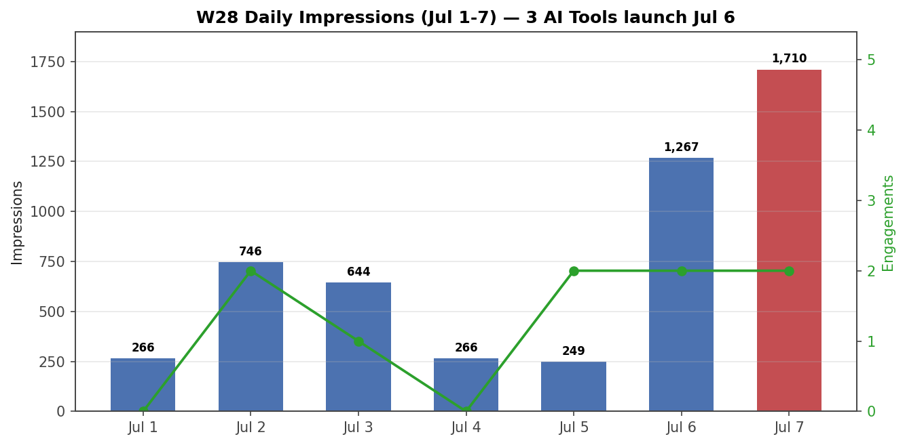

# W28 Weekly Report (Jul 1-7)

## Aggregate
- **Impressions:** 5,148
- **Reached:** 3,511
- **Engagements:** 9
- **New followers:** +14 (total 1,134)
- **Engagement rate:** 0.26%

## Daily Trend

| Day | Impressions | Engagements |
|-----|:-----------:|:-----------:|
| Jul 1 (Wed) | 266 | 0 |
| Jul 2 (Thu) | 746 | 2 |
| Jul 3 (Fri) | 644 | 1 |
| Jul 4 (Sat) | 266 | 0 |
| Jul 5 (Sun) | 249 | 2 |
| Jul 6 (Mon) | 1,267 | 2 |
| Jul 7 (Tue) | 1,710 | 2 |

## Top Posts by Impressions (W28 only)
| Post | Format | Impressions | Engagements |
|------|--------|-------------|-------------|
| 3 AI Test Tools on Same OrangeHRM App (Jul 6) | post | 10,531 | 7 |
| Detox vs Appium — RN architecture gap (Jul 2) | post | 2,092 | 4 |
| AI Interview (Jun 26, residual) | post | 596 | 1 |
| Maestro vs Appium — FrontRow case (Jul 1) | post | 155 | 1 |

## Key Insights
- **Two big drivers this week:** "3 AI Test Tools" (10,531) + "Detox vs Appium" (2,092) = 82% of all impressions
- **AI/mobile content still dominates** — both top posts are tool comparisons
- **Engagement low (9 total)** — 4 on Detox, 3 on AI Tools, 0.26% rate (below W27's 0.15%? no, W27 had 5 eng on 3,251 = 0.15%, so W28 actually higher at 0.26%)
- **Followers +14** (steady — W27: +? let me check)
- **1 new Pulse article** (Detox vs Appium) — only 72 imp, low traction

## vs W27 (3,251 imp)
- **+58%** growth (5,148 vs 3,251)
- Two strong posts carried the week vs W27's single Article 7
- Still no viral post, but consistent dual-driver pattern emerging

## Notes
- 3 AI Test Tools post was published Jul 6, final cumulative 10,531 imp (confirmed via SinglePostAnalytics)
- No carousel published this week
- Pulse articles underperform posts 10-30x (Detox article: 72 vs post: 2,092)
