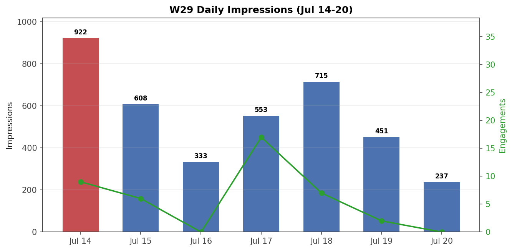

# LinkedIn Performance — Week 29, 2026

**Period:** Jul 14 – Jul 20, 2026
**Published:** 2 posts (VLM Article, Kiro Coverage Gap post)
**Total impressions:** 3,819
**Members reached:** 2,498
**Total engagements:** 41
**New followers:** +13 (total 1,259)
**Link clicks:** 6 (kiro.dev from Kiro post)

## Daily Breakdown

| Day | Impressions | Engagements |
|-----|:-----------:|:-----------:|
| Jul 14 (Mon) | 922 | 9 |
| Jul 15 (Tue) | 608 | 6 |
| Jul 16 (Wed) | 333 | 0 |
| Jul 17 (Thu) | 553 | 17 |
| Jul 18 (Fri) | 715 | 7 |
| Jul 19 (Sat) | 451 | 2 |
| Jul 20 (Sun) | 237 | 0 |

## Top Performers (7-day)

| Post | Impressions | Engagements |
|------|:-----------:|:-----------:|
| VLM Article (Jul 14) | 1,852 | 10 |
| Kiro Coverage Gap post (Jul 17) | 867 | 20 |
| Go ML Testing feed (Jul 9 carryover) | 570 | 6 |
| 3 AI Tools post (Jul 6 carryover) | 236 | — |
| AI Fluency Carousel (Jun 29 carryover) | 66 | — |

## Audience (90-day snapshot)

- **Seniority:** Senior 40% (↑2pp), Entry 19%, Director 11%, Manager 8%
- **Industry:** IT Services 35%, Software Dev 17%, Staffing 8%
- **Recruiters:** 13% combined (Recruiter 4% + TA Specialist 3% + IT Recruiter 2% + TA Partner 2% + Tech Recruiter 2%) — up from 4-6% in W27
- **Companies:** BrainRocket 2%, EPAM <1%, Sberbank <1%, TradingView <1%
- **Location:** Moscow 15%, Bengaluru 3%, Belgrade 2%, Tbilisi 2%, Lisbon 2%
- **Top job titles:** SWE 5%, Recruiter 4%, CEO 2%, CTO 2%

## Key Insights

1. **VLM Article carries the week** — 1,852 imp (48% of total). Pulse article format = widest reach. "Flying blind" hook resonates with AI-testing audience.
2. **Kiro post outperforms by engagement** — 867 imp but 20 eng (2.3% rate, 4x average). Link clicks to kiro.dev suggest CTA works. This is the strongest engagement rate since the all-time record (Jul 6).
3. **+13 followers** — best week since W26 (+14). Kiro post and VLM article both driving follows. Recruiters now 13% of audience — signal that hiring managers are watching.
4. **Mon-Tue spike** — Jul 14 (922 imp) and Jul 15 (608) suggest Monday publishing schedule works. VLM article boosted early week.
5. **Weekend drop** — Sat-Sun 451+237 = 688 (18% of week). Consistent with all prior weeks. LinkedIn audience is weekday.
6. **Recruiters 13%** — tripled since W27 (4-6%). BrainRocket 2% + EPAM <1% + TradingView <1% — specific companies watching.

## Actions

- [ ] Follow up Kiro post with a Devin comparison post (this week)
- [ ] Consider Anti-Flaky carousel for next Monday
