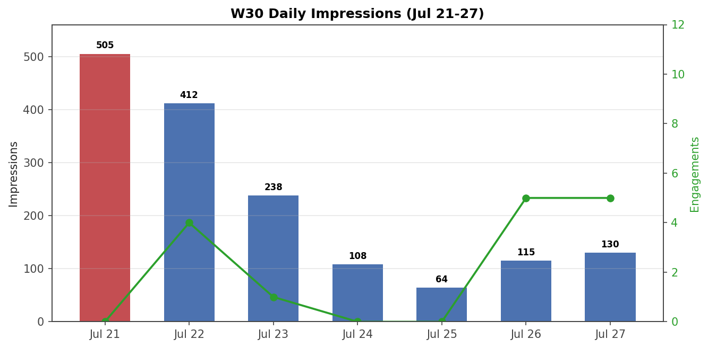

# W30 Weekly Report (Jul 21-27, 2026)

**Total:** 1,572 impressions · 1,043 reached · 6 new followers · 1,266 total

## Daily Trend

| Day | Impressions | Engagements |
|-----|------------|-------------|
| Mon 7/21 | 505 | 0 |
| Tue 7/22 | 412 | 4 |
| Wed 7/23 | 238 | 1 |
| Thu 7/24 | 108 | 0 |
| Fri 7/25 | 64 | 0 |
| Sat 7/26 | 115 | 5 |
| Sun 7/27 | 130 | 5 |

Heavy Mon-Tue (58% of week), quiet mid-week, small Article 13 lift Sat-Sun.

## Top Posts by Impressions (W30 only)

| Post | Date | Impressions | Engagements |
|------|------|------------|-------------|
| Kiro Coverage Gap Analysis | Jul 17 | 944 | 10 |
| VLM vs Blind AI Agents (article) | Jul 14 | 149 | ? |
| Autonoma deploy story | Jun 11 | 120 | ? |
| Detox vs Appium (feed) | Jul 2 | 103 | 2 |
| 3 AI Tools on OrangeHRM | Jul 6 | 72 | ? |
| Article 13 carousel | Jul 27 | 28 | 0 |
| ML in Go (feed) | Jul 9 | 30 | ? |

**Kiro post dominance:** 60% of weekly total. 10 eng, still carrying 2+ weeks after publish.

## Followers
- Week total: +6 (1/day Mon-Sat)
- Total: 1,266

## Demographics (W30)
- **Top companies:** BrainRocket 2%, EPAM <1%, Sberbank <1%, TradingView <1%
- **Location:** Moscow 15%, Bengaluru 3%, Belgrade 2%, Tbilisi 2%
- **Seniority:** Senior 40%, Entry 19%, Director 11%, Manager 8%
- **Industry:** IT Services 35%, Software Dev 18%, Staffing 8%

## Key Takeaways
1. **Kiro post is a long-tail winner** — 944 imp in week 2, 60% of total
2. **Weekend engagement spike** (Sat 5 + Sun 5) = Article 13 launch effect
3. **No viral posts** — 1,572 imp is below W26 peak (4,016). Slow week.
4. **Follower growth steady** — 6/week, consistent pattern

## Article 13 First-Day Performance
- Published Sun Jul 27: carousel 9:00 → article 11:00
- Carousel: 28 imp
- Article feed post: 34 imp, 3 eng
- Wait for W31 data for full first-week picture

*Generated: 2026-07-27*
