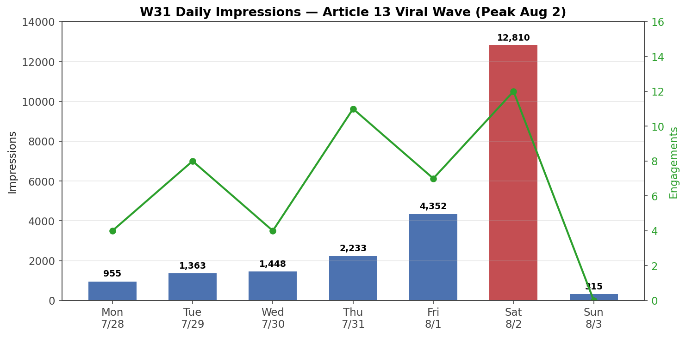

# W31 Weekly Report (Jul 28 - Aug 3, 2026)

**Total:** 23,476 impressions · ~18,100 reached (est.) · 46 engagements · 88 new followers · ~1,353 total

> Recovered retroactively from the 90-day export (May 8 - Aug 5) — no standalone W31 export existed.
> Reached estimated at W32 ratio (77%). Per-post daily breakdown unavailable.

## Daily Trend

| Day | Impressions | Engagements |
|-----|------------|-------------|
| Mon 7/28 | 955 | 4 |
| Tue 7/29 | 1,363 | 8 |
| Wed 7/30 | 1,448 | 4 |
| Thu 7/31 | 2,233 | 11 |
| Fri 8/1 | 4,352 | 7 |
| Sat 8/2 | 12,810 | 12 |
| Sun 8/3 | 315 | 0 |

**Viral wave begins:** steady Mon-Wed, acceleration Thu-Fri, **explosion Aug 2** (12,810 imp), then cliff Aug 3.

## Top Posts by Impressions (W31, estimated)

| Post | Date | Impressions (est.) | Notes |
|------|------|--------------------|-------|
| Article 13 carousel | Jul 27 | ~20,000 | ~85-90% of W31. Peak Aug 2 |
| Kiro Coverage Gap Analysis | Jul 17 | ~80 | long-tail |
| AI Agent Reality Check | Jul 27 | ~45 | Article 12 companion |
| Others (17 posts) | — | ~2,300 | 3 AI Tools, VLM, Detox, etc. |

**Article 13 is a confirmed viral hit** — published Sun Jul 27, exploded over Jul 28 - Aug 2.

## Followers
- Week total: **+88** (10 + 14 + 8 + 10 + 10 + 31 + 5)
- **Aug 2: +31 in one day** — viral spike day
- Total: ~1,353 (end of W31)

## Demographics (W31 ≈ W32, same aggregate window)
- **Audience:** BrainRocket 2%, Moscow 14%, Senior 41%, IT Services 36%
- **Content:** Bengaluru 8%, Senior 45%, IT Services 44%

## Key Takeaways
1. **Article 13 went viral on week 2** — 23,476 imp week (vs 28 imp on day 1). The biggest organic wave since the Jul 6 record.
2. **Algorithm delayed-distribution pattern** — carousels publish small, explode ~4-5 days later. Kiro (week 2) and now Article 13 (week 2) both confirm.
3. **Follower growth is content-driven** — +88 in a viral week vs +6 in a quiet week (W30).
4. **This was the transition week**: W30 (1,572) → W31 (23,476) → W32 (21,269) — the viral wave carried across W31/W32 boundary.

## Note on W31 vs W32
- W31 (Jul 28 - Aug 3): **23,476 imp** — the viral core (Aug 2 peak included)
- W32 (Jul 30 - Aug 5): **21,269 imp** — overlapping window, same wave
- Both reports are valid; W31 is the calendar week, W32 is the sliding export window

*Generated: 2026-08-05 (recovered from 90-day export)*
