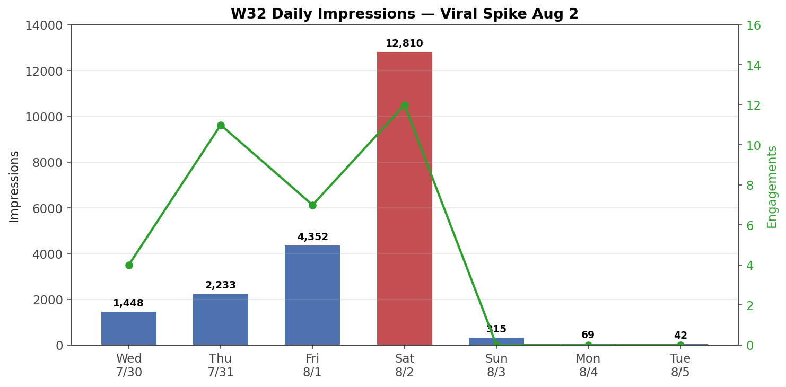
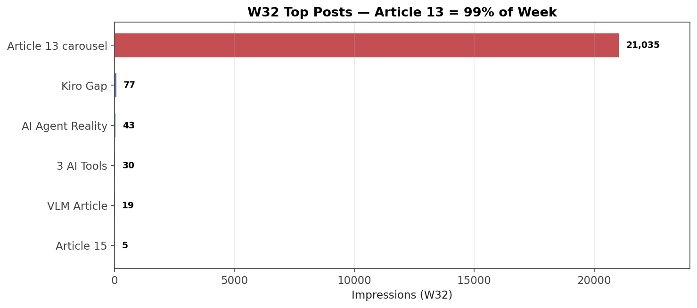
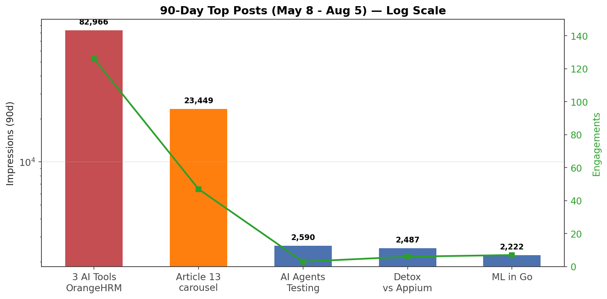

# W32 Weekly Report (Jul 30 - Aug 5, 2026)

**Total:** 21,269 impressions · 16,423 reached · 34 engagements · 67 new followers · 1,356 total

## Daily Trend

| Day | Impressions | Engagements |
|-----|------------|-------------|
| Wed 7/30 | 1,448 | 4 |
| Thu 7/31 | 2,233 | 11 |
| Fri 8/1 | 4,352 | 7 |
| Sat 8/2 | 12,810 | 12 |
| Sun 8/3 | 315 | 0 |
| Mon 8/4 | 69 | 0 |
| Tue 8/5 | 42 | 0 |

**Viral wave:** Fri-Sat spike → peak Aug 2 (12,810 imp). Then sharp drop Aug 3-5 (426 total).

## Top Posts by Impressions (W32 only)

| Post | Date | Impressions | Engagements |
|------|------|------------|-------------|
| Article 13 carousel | Jul 27 | 21,035 | 34 |
| Kiro Coverage Gap Analysis | Jul 17 | 77 | ? |
| AI Agent Reality Check | Jul 27 | 43 | ? |
| 3 AI Tools on OrangeHRM | Jul 6 | 30 | ? |
| VLM vs Blind AI Agents | Jul 14 | 19 | ? |
| Article 15 carousel | Aug 5 | 5 | 3 |

**Article 13 dominance:** 21,035 imp = **99%** of weekly total. Exploded 1 week after publish.

## Followers
- Week total: **+67** (8 + 10 + 10 + 31 + 5 + 1 + 2)
- **Aug 2: +31 in one day** — the viral spike day
- Total: 1,356

## Demographics (W32)
- **Audience:** BrainRocket 2%, Moscow 14%, Senior 41%, IT Services 36%
- **Content:** Bengaluru 8%, Senior 45%, IT Services 44%, 10K+ employees 24%

## 90-Day Snapshot (May 8 - Aug 5)
- **Total:** 135,485 imp · 89,192 reached · 1,356 followers
- **#1:** 3 AI Tools on OrangeHRM (Jul 6) — 82,966 imp, 126 eng
- **#2:** Article 13 carousel (Jul 27) — 23,449 imp, 47 eng
- **#3:** AI Agents Testing Playwright (Jun 22) — 2,590 imp
- **#4:** Detox vs Appium (Jul 2) — 2,487 imp
- **#5:** ML in Go (Jul 9) — 2,222 imp

## Key Takeaways
1. **Article 13 carousel is a viral hit** — 21,035 imp in week 2 (vs 28 on day 1). 99% of weekly total. 23,449 imp in 90d → #2 all-time.
2. **Algorithm delay confirmed** — carousel published Jul 27, exploded Aug 1-2. Week-2 spike pattern repeats (Kiro also carried in week 2).
3. **Follower spike on viral day** — +31 on Aug 2, 46% of weekly growth.
4. **Drop-off is steep** — Aug 3-5: 426 imp total. No fresh content = no impressions.
5. **Article 15 launched Aug 5** — 5 imp, 3 eng day 1. Too early to judge.

## Action Items
- [ ] Article 15 Pulse article publish → pinned comment under carousel
- [ ] Engage Maksim Dementev comment (agent-help CLI patterns)
- [ ] Watch Article 13 90d: if it reaches 30K+, consider a follow-up carousel on the same theme

*Generated: 2026-08-05*
