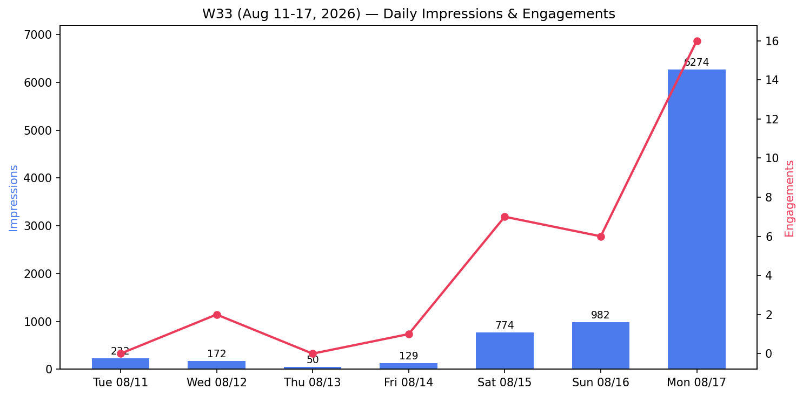
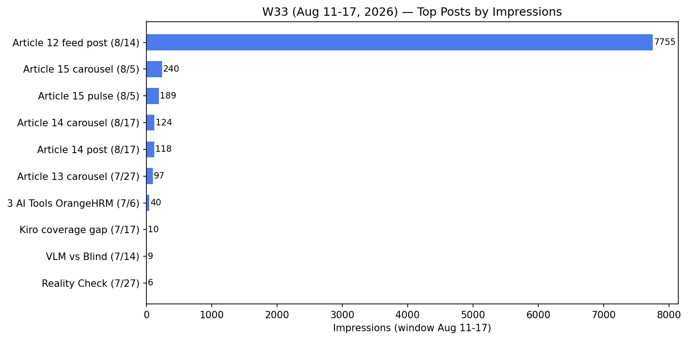

# W33 Weekly Report (Aug 11 - 17, 2026) — full week

**Total:** 8,613 impressions · 6,235 reached · 32 engagements · **+95 followers** · 1,466 total
**vs prior 7 days:** +223% impressions (1,345 → 8,613) — best week since Article 13 (W32, 21,269)

*Supersedes partial W33 draft (Aug 8-14, 1,345 imp). Full export: `raw/AggregateAnalytics_Victor Ematin_2026-08-11_2026-08-17.xlsx`.*

## Daily Trend

| Day | Impressions | Engagements |
|-----|------------|-------------|
| Tue 8/11 | 232 | 0 |
| Wed 8/12 | 172 | 2 |
| Thu 8/13 | 50 | 0 |
| Fri 8/14 | 129 | 1 |
| Sat 8/15 | 774 | 7 |
| Sun 8/16 | 982 | 6 |
| Mon 8/17 | **6,274** | 16 |

**Two-act week:** flat Mon-Thu (quiet, no fresh content since Aug 5), then Article 12 republication (Aug 14) starts building Fri → Sun, and **Aug 17 explodes to 6,274 imp** — Article 14 launch day + Article 12 field-report funnel.

## Top Posts by Impressions (window Aug 11-17)

| Post | Date | Impressions | Engagements |
|------|------|------------|-------------|
| **Article 12 feed post (3-Month Field Report)** | Aug 14 | **7,755** | **29** |
| Article 15 carousel (DevAssure O2) | Aug 5 | 240 | 1 |
| Article 15 pulse article | Aug 5 | 189 | ? |
| Article 14 carousel (AI User or AI Builder) | Aug 17 | 124 | 1 |
| Article 14 post (pulse share) | Aug 17 | 118 | ? |
| Article 13 carousel (7 Desktop AI Agents) | Jul 27 | 97 | 1 |
| 3 AI Tools on OrangeHRM | Jul 6 | 40 | 1 |
| Kiro Coverage Gap Analysis | Jul 17 | 10 | ? |
| VLM vs Blind AI Agents | Jul 14 | 9 | ? |

**Article 12 = 90% of the week** (7,755 / 8,613). Republication with new hook ("10 tools, 4 real projects, 3 months. 82,520 impressions on one post wasn't the goal") + Article 14 funnel (14 cross-links in the pulse article) drove the spike. **Funnel loop works: Article 14 → Article 12 field report → traffic.**

## Followers
- Week total: **+95** (4 + 19 + 8 + 12 + 20 + 9 + 23) — **record week** (vs +37 previous full-week, +67 in W32)
- Aug 17: **+23 in one day** — Article 14 launch day
- Total: **1,466** (+7% WoW)

## Snapshot (LinkedIn weekly progress, Aug 11-17)
- 3 posts published this week
- Profile viewers (90d): 441, **+243% vs prior 7 days**
- Search appearances (Aug 4-10): 11, 0% vs Jul 28-Aug 3

## Demographics (window Aug 11-17)

**Audience (profile viewers):**
- **Recruiting-related job titles: 11%** (TA Specialist 4% + Recruiter 3% + IT Recruiter 2% + TA Partner 2%) — hiring market is actively watching
- Locations: Moscow 13%, Belgrade 4%, Bengaluru 3%, London 2%, Lisbon 2%, Tbilisi 2%
- Seniority: Senior 41%, Entry 20%, Director 10%, Manager 8%, CXO 6%
- Industry: IT Services 35%, Software Dev 18%, Staffing & Recruiting 8%
- Company size: 10K+ 20%, 1-5K 16%

**Content (post viewers):**
- **QA-heavy: QA Engineer 11% + QA Automation Engineer 7% + QA Specialist 5% + SQA Engineer 3% + Test Engineer 2% = 28% QA job titles** — the content lands in the QA community
- Locations: India-heavy (Bengaluru 5%, Pune 2%, Hyderabad 2%, Chennai 2%, Delhi 2%), London 2%, Sydney 2%, Kyiv 2%
- Seniority: Senior 45%, Entry 28%
- Industry: IT Services 46%, Software Dev 28%
- Company size: 10K+ 24% (EPAM, Cognizant, TCS, Infosys, Endava, Oracle, Accenture...)

## Key Takeaways
1. **Article 12 republication is the engine** — 7,755 imp / 29 eng in 4 days = 90% of the week. New hook + Article 14 funnel = +223% WoW. The "field report" format keeps working.
2. **Cross-linking loop proven** — Article 14 (Aug 17) cross-links to Article 12 field report; Article 12 cross-links back. Content that references other content compounds.
3. **Aug 17 = 6,274 imp single day** — launch day spike (Article 14 carousel + article + funnel). Biggest single day since Article 13's Aug 2 peak (12,810).
4. **Record follower week (+95)** — 1,466 total; +23 on launch day. Active publishing + field-report depth = follower magnet.
5. **Recruiters watching (11% of profile viewers)** — но важно: контакты недели (Taksh, Sergei, Matthias, Miljana) — это НЕ инбаунд от видимости, а холодный аутрич пользователя по предложениям LinkedIn («People You May Know»). Единственный настоящий инбаунд — Lada (CBSbutler). Вывод: профиль-видимость даёт recruiter-traffic, а конверсия в диалоги пришла из проактивного аутрича. Обе части работают вместе.

## Action Items
- [ ] Let Article 14 long-tail build in W34 (expect same pattern as Article 15: week-2 residual 200-700 imp)
- [ ] Article 12 pulse article metrics — track via article views; report later
- [ ] Engage Taksh Chanana (TestSwiftly) thread — coordinates vs tagging reply sent, follow up when he responds
- [ ] Sergei Gapanovich / Matthias Rasking — reply drafts ready (connection wave this week)
- [ ] Next publish cadence: don't let 2 quiet weeks happen again — Article 16 (CARBON harness vs framework) candidate

*Generated: 2026-08-17 from full-week export (Aug 11-17)*
